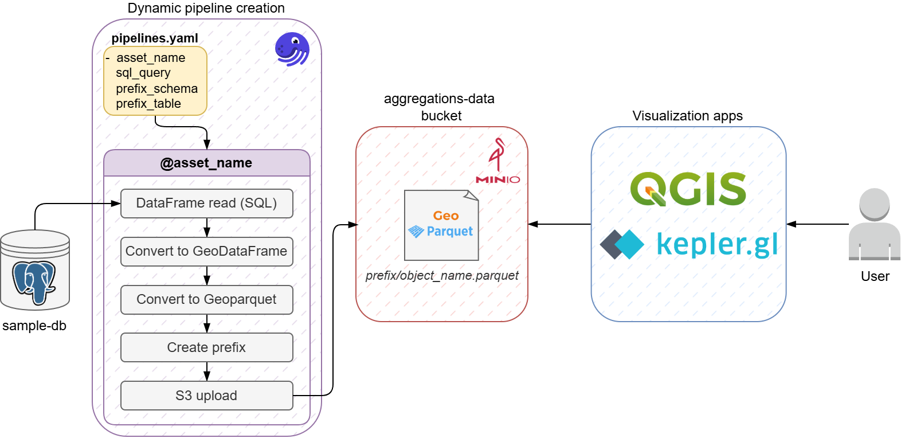

# GeoParquet Share



## To run this project:

1. Create a `.env` file in the project root directory, like so:

```sh
# Sample DB
POSTGRES_HOST='postgis-source'
POSTGRES_PORT=5432
POSTGRES_DATABASE='sample_db'
POSTGRES_USER='postgres'
POSTGRES_PASSWORD='db_strongpassword'

# MinIO
MINIO_API_URL='http://minio-target:9000'
MINIO_ROOT_USER='minio_admin'
MINIO_ROOT_PASSWORD='minio_strongpassword'

# Get MinIO access and secret keys
MINIO_ACCESS_KEY='a_minio_access_key'
MINIO_SECRET_KEY='a_minio_secret_key'
```

2. Execute the `docker compose up -d` command to create the three containers.
    - A Postgis example **source**
    - A Minio **target** container
    - Dagster **dynamic pipeline creation** project

3. Navigate to Minio Web Console at `http://localhost:9001`  and create a new pair keys. Then place them on the `.env` file.

4. Navigate to Dagster's Web Interface at `http://localhost:3000` and execute:
    - Fake meteo data Job
    - Postgis to Minio Job